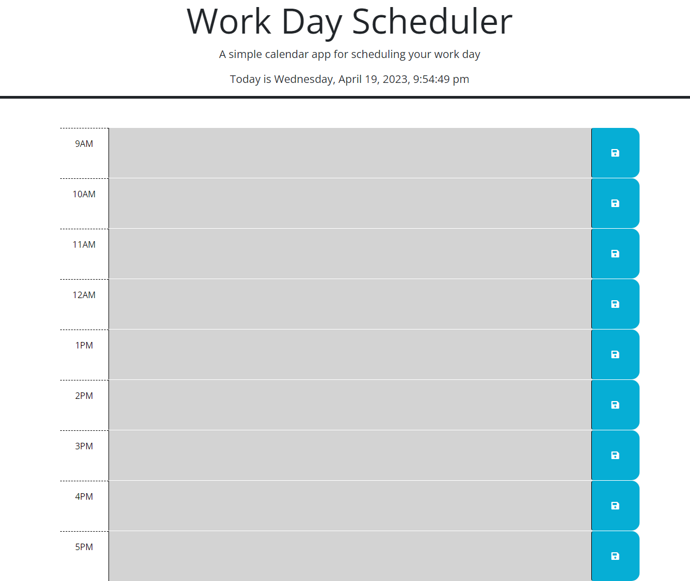

# Work Day Scheduler
Work Day Scheduler using Third-Party APIs

## Description

The purpose of this Work Day Scheduler project was to get bootcamp students more familiar with using Jquery. With Jquery, they have to find a way to store data inputted from the user in multiple text areas with multiple save buttons all with the same class tags. They have to utilise the 'this' keyword to select the parent id tag to store each value entered by the user, and do the same to pull the value from local storage to keep on the page even upon refresh. 

## Installation

N/A

## Usage

This website will help users store information about their work day. On the top of the page, it will display the current date and time down to the seconds. In each time block below, the user can enter text of any plans, activities and or meetings that they may have that day. After hitting the save button next to the text box, there will be text that flashes for about two seconds, indicating that data has been saved into local storage. Once that is done, the text will stay on the page even on reload, allowing users to safely and easily plan out their day without worrying about losing the information they typed. 

<a href="https://github.com/elvislau74/work-day-scheduler">Click here for the GitHub Repository</a>

<a href="https://elvislau74.github.io/work-day-scheduler/">Click here for the Live Site</a>

## Credits

N/A

## License

Please refer to the LICENSE in the repo. 
